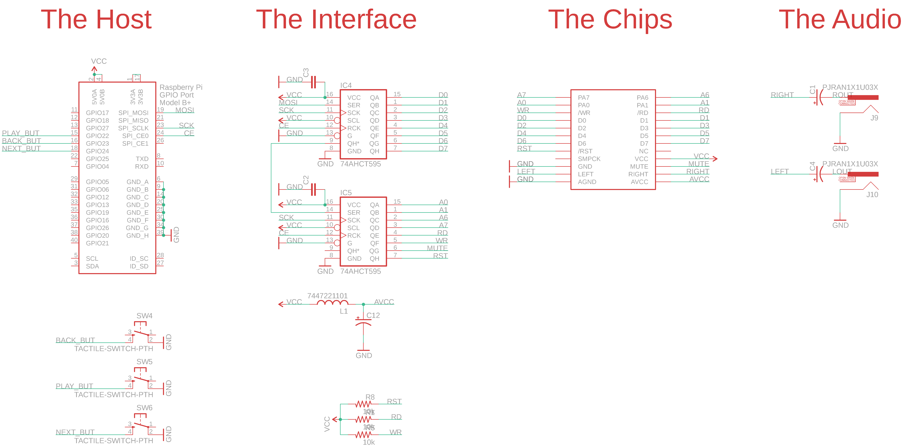
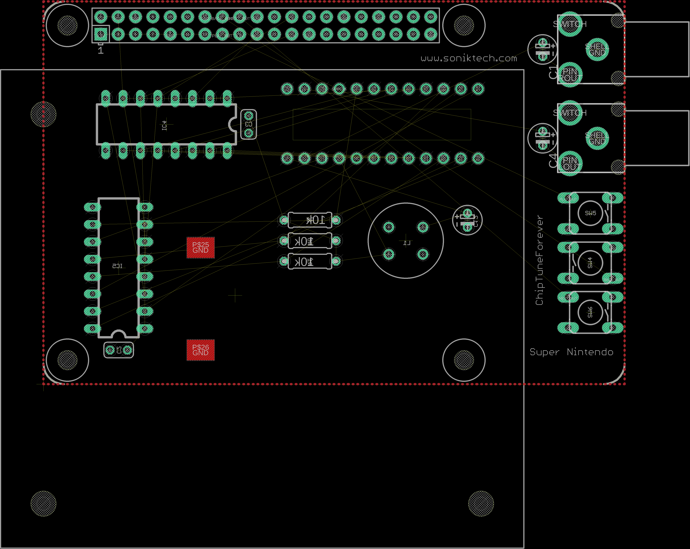

# super-nintendo-forever
A Raspberry Pi Hat for controlling an SNES Sound Module using GPIO

If you want to replay the sounds of the past, nothing beats authentic hardware. This project aims to provide an easy-to-control interface between devices that can control GPIO accurately and the SNES audio module. The goal is to "play back" SNES sound data accurately through the module as if it was an actual game.

